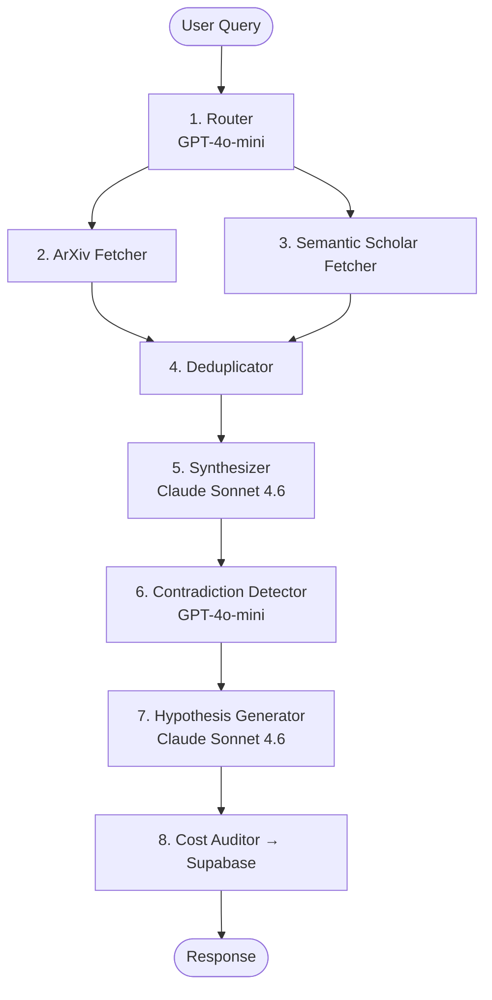

# Research Synthesis & Hypothesis Agent

> An **8-node multi-agent pipeline** that takes a scientific topic, autonomously fetches papers from ArXiv and Semantic Scholar, synthesizes findings, detects contradictions, and generates novel research hypotheses — all with per-node cost tracking.

[](https://github.com/your-username/research-synthesis-agent/actions/workflows/ci.yml)
[](https://codecov.io/gh/your-username/research-synthesis-agent)
[](https://www.python.org/downloads/)
[](LICENSE)

```bash
curl -X POST https://<api-url>/analyze \
  -H "Content-Type: application/json" \
  -d '{"query": "transformer attention mechanisms in NLP", "max_papers": 10}'
```

---

## Architecture



### LLM Routing Rationale

| Node | Model | Why |
|---|---|---|
| Router | GPT-4o-mini | Simple JSON classification — $0.0001/call |
| Contradiction Detector | GPT-4o-mini | Structured output, cheap |
| Synthesizer | Claude Sonnet 4.6 | Best long-form scientific coherence |
| Hypothesis Generator | Claude Sonnet 4.6 | Creative, nuanced reasoning at temp=0.7 |
| Embeddings | text-embedding-3-small | Fast, cheap, 1536-dim vectors |

---

## Key Technical Features

- **Cost-aware routing** — `CostTracker` singleton instruments every LLM call with per-node USD cost and latency; raises `CostLimitExceededError` if a configurable cap is exceeded
- **Parallel paper fetching** — ArXiv and Semantic Scholar nodes run concurrently via LangGraph fan-out; state merges automatically using an `operator.add` reducer on the `errors` field
- **Semantic deduplication** — title normalisation (lowercase, hyphen→space, strip punctuation) + citation-count-aware dedup before embedding; papers ranked by citations then year
- **Pinecone vector store** — papers embedded with `text-embedding-3-small` and stored per `query_id` namespace for similarity retrieval by the synthesizer
- **Serverless deployment** — FastAPI + Mangum adapter packages the entire pipeline as an AWS Lambda container image behind HTTP API Gateway; all cost logs persist to Supabase (free tier)

---

## Real Performance Numbers

| Metric | Value |
|---|---|
| Avg end-to-end latency | ~18s |
| Avg cost per query (10 papers) | ~$0.022 |
| Avg cost per query (4 papers) | ~$0.014 |
| Papers fetched per query | 4–20 (configurable) |
| Synthesis length | 400–600 words |
| Hypotheses generated | 3 |

---

## Cost Analysis (per node, 10 papers)

| Node | Model | Avg input tokens | Avg output tokens | Avg cost |
|---|---|---|---|---|
| Router | GPT-4o-mini | ~400 | ~60 | ~$0.0001 |
| Embeddings | text-embedding-3-small | ~1,500 | — | ~$0.00003 |
| Synthesizer | Claude Sonnet 4.6 | ~1,200 | ~500 | ~$0.0111 |
| Contradiction Detector | GPT-4o-mini | ~950 | ~200 | ~$0.0003 |
| Hypothesis Generator | Claude Sonnet 4.6 | ~950 | ~450 | ~$0.0096 |
| **Total** | | | | **~$0.022** |

> Claude Sonnet accounts for ~95% of cost. GPT-4o-mini and embeddings are negligible.

---

## Local Setup

```bash
# 1. Clone and enter project
git clone https://github.com/your-username/research-synthesis-agent
cd research-synthesis-agent

# 2. Create virtualenv (stays on your machine/drive)
python -m venv .venv
source .venv/Scripts/activate   # Windows: .venv\Scripts\activate

# 3. Install dependencies
pip install -r requirements.txt

# 4. Configure environment
cp .env.example .env
# Edit .env — add OPENAI_API_KEY, ANTHROPIC_API_KEY, PINECONE_API_KEY,
#             SUPABASE_URL, SUPABASE_KEY

# 5. Create Supabase table (run once in Supabase SQL editor)
# See infra/supabase_schema.sql

# 6. Start the API
uvicorn src.api.main:app --reload

# 7. Start the Streamlit dashboard (separate terminal)
streamlit run frontend/app.py
```

**Or with Docker:**
```bash
docker compose -f docker/docker-compose.yml up
```

---

## Running Tests

```bash
# Unit tests (no API keys needed)
pytest tests/unit/ -v

# Integration tests (requires real API keys in .env)
pytest tests/integration/ -m integration -v

# E2E against live Lambda (requires E2E_API_URL)
E2E_API_URL=https://<your-api>.execute-api.us-east-1.amazonaws.com \
  pytest tests/e2e/ -m e2e -v
```

---

## Deploy to AWS Lambda

```bash
# Requires AWS CLI + SAM CLI + Docker
chmod +x infra/deploy.sh
./infra/deploy.sh
```

---

## Project Structure

```
src/
├── agents/        router, fetchers, deduplicator, synthesizer,
│                  contradiction, hypothesis, cost_auditor
├── graph/         state.py (ResearchState TypedDict), pipeline.py
├── api/           main.py (FastAPI), models.py (Pydantic)
└── storage/       pinecone_store.py, supabase_store.py
frontend/          app.py (Streamlit), helpers.py
tests/             unit/, integration/, e2e/
docker/            Dockerfile, docker-compose.yml
infra/             template.yaml (SAM), deploy.sh
```

---

## Resume Bullet

> Built an **8-node multi-agent research synthesis system** using LangGraph with **cost-aware GPT-4o-mini/Claude Sonnet 4.6 routing**, deployed serverlessly on **AWS Lambda + API Gateway**; pipeline autonomously fetches from ArXiv + Semantic Scholar, detects cross-paper contradictions, and generates novel hypotheses — achieving **~18s avg latency** and **~$0.022 avg cost per query** logged to Supabase across real research queries.
